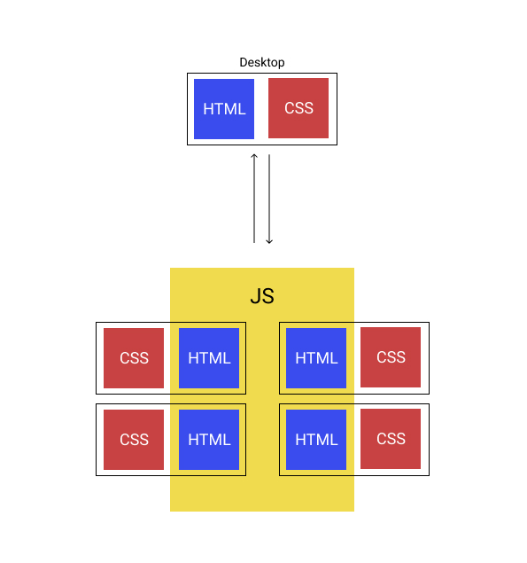
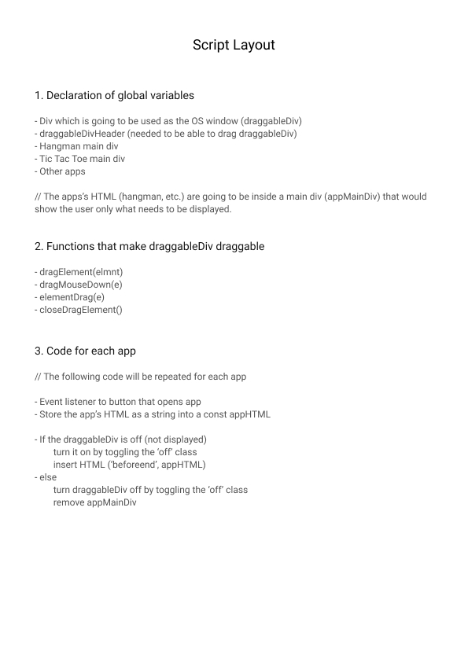
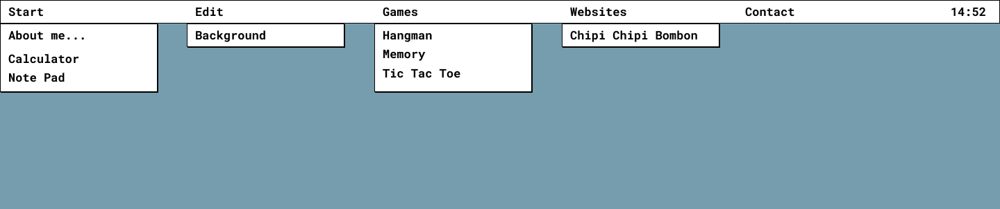
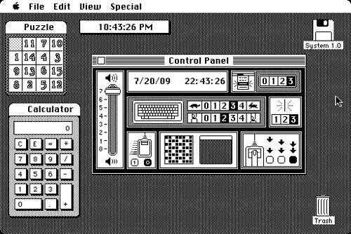
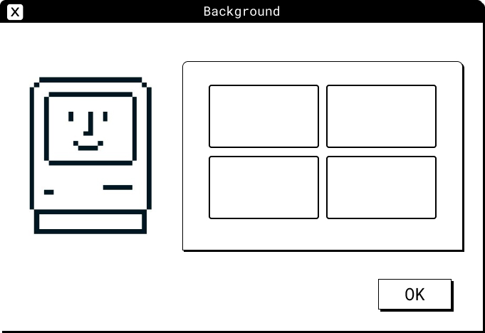

# Project log

## Overview

A website that simulates the Macintosh 1984 operating system. 

## Details

- This is a project I will work on in my free time. 

- The main reasons of making this project are learning and practicing. It is also intended to be used as a porfolio website. 

- The content requierd for this website will be fonts and icons, and also 'Aplications' which will be opened in the website to create operating system like environment. Since my main focus is functionality (and this is going to be a pretty time consuming proyect), I will save icons, style, animation, etc. for the round-up of the project. 

- Regarding the work that needs to be done, I will start with the Desktop. Then the most important thing will be creating a draggable and (hopefully) resizable window, which will contain the oppend apps. The way a plan to do it, is to write HTML from JS. This way I can re-use this window, and have the project more organized. 
One of the biggest challenges of this proyect is organization. Since this is my first 'big' proyect, I would like to put a lot of time into making the code readable and neat. 
After that I will adapt my projects (games, etc) to fit the 'OS' environment well. I will most likely run into a lot of problems and errors, which is why I also intend to make a guide on how to adapt JS software to run well in this 'OS'.

## Wireframes

### JavaScript file structure

### Script layout

### Nav content

### Original Macintosh desktop

### Background Window

## Time

- Estimated: 20 hours in one week.
- Actual (add this on project completion)

## New skills

(what did you research for this project?)

## Challenges + lessons learned

(What didn't go well? How would you advise future-you so it goes better next time?)

## Achievements

(What did you do this time that was an improvement on last time? Acknowledge your progress, you've earned it!)

## Buddy sign-off

(get together with your buddy, check each other's logs for completeness, talk through your projects as a pair. Include their name here once you're finished.)
